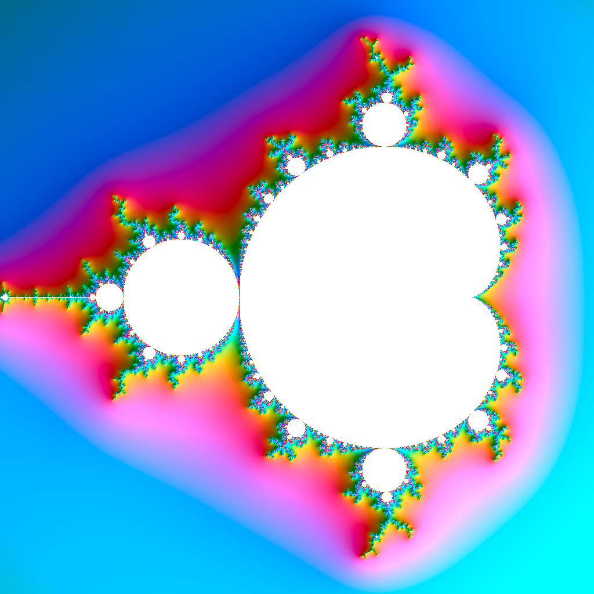
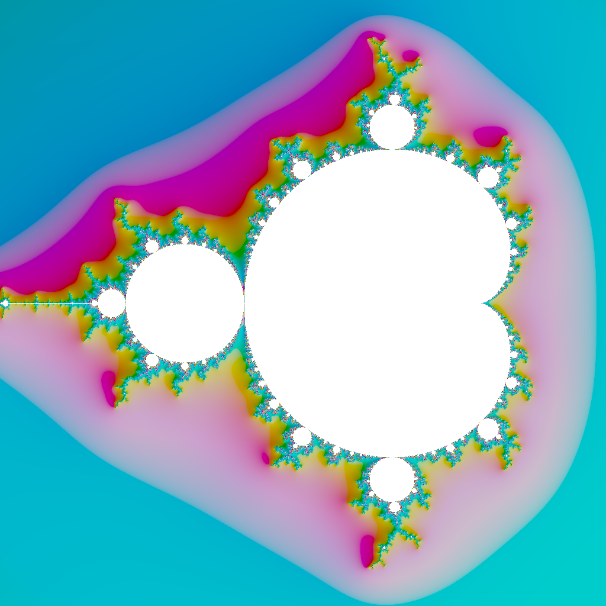

[](https://pkg.go.dev/fortio.org/hdr)
[](https://goreportcard.com/report/fortio.org/hdr)
[](https://github.com/fortio/hdr/releases/)
[](https://github.com/fortio/hdr/actions/workflows/include.yml)
[](https://codecov.io/github/fortio/hdr)

# hdr

Support for high dynamic range synthetic PNG image in go

Demonstration in demo/ producing:

SDR:



HDR:



## Install
Use in your own code importing "fortio.org/hdr" and Encode() away.

You can get the demo binary from [releases](https://github.com/fortio/hdr/releases)

Or just run
```
CGO_ENABLED=0 go install fortio.org/hdr/hdr_demo@latest  # to install (in ~/go/bin typically) or just
CGO_ENABLED=0 go run fortio.org/hdr/hdr_demo@latest  # to run without install
```

or
```
brew install fortio/tap/hdr
```

or
```
docker run -ti -v `pwd`:/home/user fortio/hdr
```


## Usage

```
$ hdr_demo help
hdr_demo v1.0.0 usage:
        hdr_demo [flags]
or 1 of the special arguments
        hdr_demo {help|envhelp|version|buildinfo}
flags:
  -chroma float
        chroma (saturation) for coloring (default 80)
  -hue-freq float
        hue frequency multiplier for coloring (higher means more color cycles) (default 0.35)
  -light-angle float
        light angle in degrees for shading (azimuth) (default 45)
  -light-height float
        light height for shading (elevation, higher means more light from above) (default 1.5)
  -profile-cpu file
        write cpu profile to file
  -profile-mem file
        write memory profile to file
  -shading float
        range for shading lightness (0 = no shading, 100 = full range from black to white) (default 70)
```
